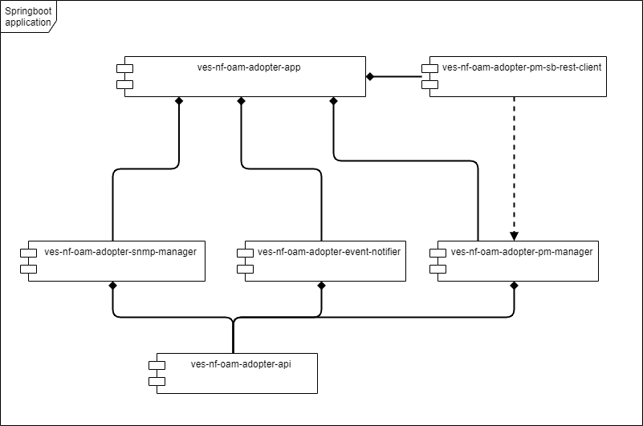

.. This work is licensed under a Creative Commons Attribution 4.0 International License.
.. SPDX-License-Identifier: CC-BY-4.0
.. Copyright (C) 2021 AT&T Intellectual Property. All rights reserved.

Developer Guide
===============

Architecture design of FM / PM Adopter
######################################

Adapter has been design to provided common libraries that can be reused to generate application as per vendor needs.

Modules
-------

- **o-ran-ves-adapter-api** module provides generated POJOS from VES 7.1 json Schema, together with VesEventNotifier interface
- **o-ran-ves-adapter-event-notifier**  module provides VesEventNotifier service implementation, responsible of forward VES events to the VES Collector via REST
- **o-ran-ves-adapter-pm-manager** module is responsible of read and translate CSV PM files from devices end point, translate it to VES event formant, and forward it to VesEventNotifier.
- **o-ran-ves-adapter-snmp-manager** module is responsible of listend for SNMP traps on UDP port (Default 162), translate it to VES event formant, and forward it to VesEventNotifier.
- **o-ran-ves-adapter-app** module contains the application, is responsible to assemble the whole set of libraries.
- **ves-nf-oam-adopter-pm-sb-rest-client** module contains mock vendor specific PM REST Client implementation (ves-nf-oam-adopter-mock app).

.. image:: nf-oam-adopter-diagram.png
  :alt: Diagram

